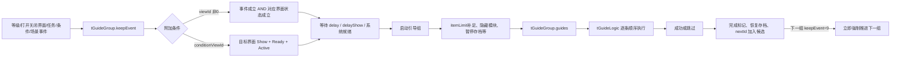

# Bubble 新手引导配置说明（给 AI 使用）

> 适用源：`策划/配置表/Table/Y_引导表_tGuideGroup.xlsx`  
> 读取快照：2026-09-01；源文件 SHA-256：`646144c2721e7af11eed5faaca2d294fd82649a37e802716e42ee0ddbdc3f024`  
> 当前规模：`tGuideGroup` 83 条正式记录，`tGuideLogic` 136 条正式记录，22 条根链。  
> 经验更新：2026-09-02，已补充“二楼引导”错误复盘、跨界面三步链配置规则和项目对话文案规范。  
> 团队工作流入口：[新手引导AI配置工作流.md](新手引导AI配置工作流.md)。团队成员按工作流操作，本文件作为字段和规则详表。  
> 结论：这是“事件驱动的引导组 + 顺序执行的引导步骤”两层模型。今后让 AI 配置时，必须先配/复用逻辑步骤，再由组表挂接，并同时校验外部 ID、UI 路径、严格 JSON 和中断恢复。

## 1. 先看结论：两张正式表怎么协作



- `tGuideGroup` 决定“什么时候触发、是否串到下一组、执行哪些步骤、如何恢复/收尾”。
- `tGuideLogic` 决定“每一步具体做什么”：点 UI、拖拽、场景点击、对话、CG、移动镜头、行为系统等。
- `tGuideGroup.guides=[逻辑ID...]` 是二者的直接关系；数组顺序就是执行顺序。
- `nextId` 只负责把下一组加入候选；下一组仍按自己的触发事件等候。唯一例外是下一组 `keepEvent=9`，它会在上一组完成后被强制触发。
- `viewId` 是“触发条件的界面”，`guideViewId` 是“步骤查找 UI 控件的根界面”，两者经常不同，不可互换。

## 2. 工作簿各 Sheet 的角色

| Sheet | 性质 | 用途 | 能否直接作为导出数据 |
|---|---|---|---|
| `tGuideGroup` | 正式配置 | 触发、链路、组级状态、中断恢复、步骤数组 | 是；B:AD，AE=`END` |
| `tGuideLogic` | 正式配置 | 每个可执行引导步骤 | 是；B:AW，AX=`END` |
| `引导准备` | 操作说明画布 | 存读档、日志筛选、Alt+0 引导工具、定位 UI、查 `eVIEW_ID` | 否 |
| `引导备忘1` | 策划备忘/公式草稿/历史区 | `mainUi` 模板、镜头参数、CG 跳过时间，以及“原本待废弃”的旧表片段 | 否；尤其 214 行后的旧数据不能回填正式表 |
| `引导备忘2` | 策划备忘画布 | 给控件加点击能力、打开 prefab、提交、镜头偏转 | 否 |
| `界面id` | 辅助索引 | `eVIEW_ID` 的表内查询副本，为 0/0 辅助公式服务 | 否；最终以代码枚举为准 |
| `功能开启&首次推送` | 规划参考 | 功能开启等级与首次推送记录 | 否；不是引导运行时直接依赖 |

工作簿采用项目配置规范：第 1 行字段说明、第 2 行中文名、第 3 行英文字段名、第 4/5 行客户端/服务端标记、第 6 行类型、第 7 行开始数据，遇到 `END` 停止导出。AI 不得改变这 6 行协议、不得删除 `END`、不得改字段拼写。

三个画布式页面的全部非空单元格、批注和 19 张原图已保真转录到[原表备忘页附录](新手引导配置说明_附录_原表备忘页.md)。

## 3. `tGuideGroup`：引导组字段

| 列 | 字段 | 类型 | C/S | 配置说明 |
|---|---|---|---|---|
| B | `id` | `int` | 1/0 | 引导组唯一 ID。先查重；不要猜测正式号段。 |
| C | `nextId` | `int` | 1/0 | 本组完成后加入下一组。填 0/空表示链结束。若下一组 keepEvent=9，会被强制触发。 |
| D | `reGuideIdOnBreak` | `int` | 1/0 | 启动时发现本组曾运行未完成时，改为重新加入的组 ID。 |
| E | `withoutSaving` | `int` | 1/0 | 0 正常；1 组内暂停存档、结束恢复；2 结束后仍保持暂停。高风险字段。 |
| F | `keepEvent` | `int` | 1/0 | 引导组触发事件枚举，参数见“触发事件”章节。 |
| G | `viewId` | `int` | 1/0 | 触发界面 ID；keepEvent=0/1/2/3 使用。非 0 时还会形成界面状态 AND 条件。 |
| H | `guideViewId` | `int` | 1/0 | 逻辑步骤查找 UI 节点时的根界面 ID，不等同于触发 viewId。 |
| I | `界面id备注` | `str` | 0/0 | 策划辅助列，客户端/服务端均为 0，不导出。由 XLOOKUP 生成时可无缓存。 |
| J | `sceneEventType` | `int` | 1/0 | keepEvent=4 的场景事件类型。 |
| K | `keepUINode` | `str` | 1/0 | keepEvent=2/3 时匹配的 UI 节点名。 |
| L | `roomId` | `int` | 1/0 | 复用参数槽：任务、条件、矿坑、商店页签、角色等 ID，含义由 keepEvent 决定。 |
| M | `formLevel` | `int` | 1/0 | 达到该玩家等级时加入候选组；99999 是本表常用的“仅靠链路/其他事件进入”写法。 |
| N | `formBuilding` | `int` | 1/0 | keepEvent=10 时对应 tFunction.id；表头虽写建筑，代码按功能 ID 使用。 |
| O | `hideModule` | `arr` | 1/0 | 引导期间隐藏/关闭的 SystemEntry 数组。当前表几乎全为 [26]，但代码枚举无 26，见风险项。 |
| P | `hideModuleOnComplete` | `arr` | 1/0 | 引导完成后处理的 SystemEntry 数组。必须按当前代码枚举核对。 |
| Q | `alone` | `bool` | 1/0 | 表注释称 true 为强引导/不可并存，但当前控制器等待逻辑疑似反向；保持现有 True，未经程序确认不要改 False。 |
| R | `conditionViewId` | `arr` | 1/0 | 额外界面条件，常见 [0,viewId]；需目标界面已显示、Ready 且 Active。 |
| S | `delayShow` | `bool` | 1/0 | 为 true 时等待全屏层清空后再展示。 |
| T | `itemLimit` | `arr` | 1/0 | 成对数组 [itemId,targetAmount,...]；开组时只补足差额，长度必须为偶数。 |
| U | `delay` | `int` | 1/0 | 触发后到执行引导的延迟，单位按当前代码/既有用法理解为秒。 |
| V | `allowSkip` | `bool` | 1/0 | 是否允许跳过；跳过仍走组完成收尾。 |
| W | `completedIdOnStart` | `arr` | 1/0 | 组开始时直接标记完成的其他组 ID 数组；中断时会回滚。 |
| X | `completedIdOnFinish` | `arr` | 1/0 | 组完成时标记完成的其他组 ID 数组；用于清理分支。 |
| Y | `addGuideOnBreak` | `int` | 1/0 | breakRestartType=2 的恢复路径中，额外加入的组 ID。 |
| Z | `finishGuideOnBreak` | `arr` | 1/0 | breakRestartType=2 的恢复路径中，直接标完成的组 ID 数组。 |
| AA | `breakRestartType` | `int` | 1/0 | 0 从头；1 从已记录步骤后一项续跑；2 启动时直接完成本组并执行中断分支处理。 |
| AB | `guides` | `arr` | 1/0 | 按顺序执行的 tGuideLogic.id 数组；这是组表到逻辑表的核心外键。 |
| AC | `lockOnFinish` | `bool` | 1/0 | 最后一步完成后继续锁输入，直到下一逻辑创建时解锁。链断会造成卡死风险。 |
| AD | `unlockFuncId` | `arr` | 1/0 | 提前开放的 tFunction.id 数组。 |

### 3.1 触发事件 `keepEvent`

| 值 | 代码枚举 | 含义 | 参数/注意事项 | 当前条数 |
|---:|---|---|---|---:|
| 0 | `OnOpenView` | 打开界面 | viewId；若非 0，仅在对应界面状态满足时触发 | 22 |
| 1 | `OnCloseView` | 关闭界面 | viewId | 6 |
| 2 | `OpenUINode` | 打开 UI 节点 | viewId + keepUINode；代码只比较节点名 | 0 |
| 3 | `CloseUINode` | 关闭 UI 节点 | viewId + keepUINode；代码只比较节点名 | 1 |
| 4 | `SceneEvent` | 场景自定义事件 | sceneEventType | 2 |
| 6 | `EnterScene` | 进入场景 | 表面上用 roomId，但当前代码把房间比较注释掉，任何 SceneEnterEvent 都可能命中 | 1 |
| 9 | `ForceNextGroupId` | 由上一组强制推进 | 必须通过上一组 nextId 加入；完成上一组后主动发事件 | 32 |
| 10 | `UnlockFunc` | 功能解锁 | formBuilding = tFunction.id | 1 |
| 11 | `FinishTask` | 完成任务 | roomId = tTask.id | 1 |
| 12 | `DiningUpgrade` | 餐厅升级 | 无额外参数 | 1 |
| 13 | `ClickMineTile` | 点击矿块 | roomId = tMineTile.id | 1 |
| 14 | `ConditionId` | 通用条件达成 | roomId = tCommonCondition.id；加入组时也会立即检查 | 11 |
| 15 | `CreateTask` | 创建任务 | roomId = tTask.id；加入组时也会立即检查 | 0 |
| 16 | `EnterShopTab` | 进入商店页签 | roomId = 商店页签 ID，并检查 hasUnlockCell | 2 |
| 17 | `EnterMineLevel` | 进入矿层 | roomId = tMine.id | 2 |
| 18 | `NewRoleViewOpened` | 新角色界面打开 | roomId = tRole.id | 0 |

关键规则：

1. 任何组只要 `viewId>0`，代码会同时监听该界面的状态变化；事件条件和界面状态是 AND，不是 OR。触发不了时优先排查这一点。
2. `formLevel` 是“加入候选组”的入口：启动时会以 0 级事件加载 `formLevel=0`；以后只在等级事件值精确相等时加入。当前表用 `99999` 表示基本不靠正常等级进入、只靠 `nextId` 或其他逻辑串入。
3. `keepEvent=9` 不能当普通独立触发器使用，必须先由上一个已完成组的 `nextId` 指向它。
4. `keepEvent=6` 的 `roomId` 过滤在当前代码中被注释；不要依赖“只在某房间触发”。
5. `keepEvent=14/15` 在加入组时会立即检查既有条件/任务状态，适合“玩家可能早已满足”的补触发场景。

## 4. `tGuideLogic`：单步逻辑字段

| 列 | 字段 | 类型 | C/S | 配置说明 |
|---|---|---|---|---|
| B | `id` | `int` | 1/0 | 逻辑步骤唯一 ID；由 tGuideGroup.guides 引用。 |
| C | `description（策划备注）` | `str` | 0/0 | 本表有两个同名字段：C 列是 0/0 策划备注，D 列是客户端导出的埋点/描述。 |
| D | `description（导出描述）` | `str` | 1/0 | 本表有两个同名字段：C 列是 0/0 策划备注，D 列是客户端导出的埋点/描述。 |
| E | `pauseGame` | `bool` | 1/0 | 执行本步时是否暂停相关游戏运行。 |
| F | `funcType` | `int` | 1/0 | 步骤类型枚举 GuideFunc，决定其余字段如何解释。 |
| G | `endEvent` | `int` | 1/0 | 结束时派发/处理的事件参数；仅在对应逻辑实现需要时填写。 |
| H | `maskStatus` | `int` | 1/0 | 0 半透明遮罩；1 透明但拦截；2 不显示遮罩。 |
| I | `avoidFalseClickTime` | `int` | 1/0 | 防误触等待时间。 |
| J | `funcParam` | `int` | 1/0 | 类型专用参数；如进/退矿层、清顾客并生成等。 |
| K | `mainUi` | `str` | 1/0 | 主界面五块区域显隐 JSON：[[节点名,"0/1"],...]。 |
| L | `dialogueGroupId` | `int` | 1/1 | 对话组 ID，关联 tDialogueTable。 |
| M | `effectIdArray` | `arr` | 1/0 | 引导特效 ID 数组，关联 tEffectRes；与位置数组同长度。 |
| N | `effectPosType` | `arr` | 1/0 | 各特效的位置类型数组；与 effectIdArray 对齐。 |
| O | `effectPosArray` | `arr` | 1/0 | 各特效偏移二维数组；必须是严格 JSON，不能写 00。 |
| P | `followTarget` | `bool` | 1/0 | 特效/遮罩是否跟随目标。 |
| Q | `uiComPath` | `str` | 1/0 | 相对 guideViewId 根节点的 UI 路径；找不到时会退回全局 UI 根。点击目标需 EventAdaptor。 |
| R | `uiClikCondition` | `int` | 1/0 | 0 点目标完成；1 任意点击完成。字段名拼写按代码保留。 |
| S | `maskType` | `int` | 1/0 | 遮罩形状/类型。 |
| T | `maskImg` | `str` | 1/0 | 遮罩图片资源路径。 |
| U | `maskAutoSize` | `int` | 1/0 | 1 自动匹配目标 Rect；否则使用宽高或半径。 |
| V | `maskSizeW` | `int` | 1/0 | 手动遮罩宽。 |
| W | `maskSizeH` | `int` | 1/0 | 手动遮罩高。 |
| X | `maskRadius` | `int` | 1/0 | 圆形/范围遮罩半径。 |
| Y | `offect` | `arr` | 1/0 | 遮罩偏移；字段拼写按代码保留。 |
| Z | `specialIndexSmoke` | `arr` | 1/0 | 工作簿导出列，但当前 tGuideLogic.cs 没有该字段；不可自行使用。 |
| AA | `maskCellType` | `int` | 1/0 | 格子类遮罩类型。 |
| AB | `maskCellPos` | `arr` | 1/0 | 格子类遮罩位置。 |
| AC | `secondMaskPos` | `str` | 1/0 | 第二遮罩位置。 |
| AD | `accelerate` | `int` | 1/0 | CG/动画加速参数。 |
| AE | `cgPath` | `str` | 1/0 | CG 预制体/资源路径。 |
| AF | `cgAniName` | `str` | 1/0 | CG 动画名。 |
| AG | `cgTime` | `arr` | 1/0 | CG 可跳过/分段时间数组。 |
| AH | `blackScreen` | `int` | 1/0 | CG 黑屏控制。 |
| AI | `clickTimes` | `int` | 1/0 | 所需点击次数；0/1 都是一击完成，>1 才累计。 |
| AJ | `uiDragEffectIndex` | `int` | 1/0 | 拖拽时选用 effectIdArray 的零基索引。 |
| AK | `uiDragTargetPoint` | `arr` | 1/0 | 拖拽目标点。 |
| AL | `uiDragTargetPosType` | `int` | 1/0 | 拖拽目标点的坐标类型。 |
| AM | `uiDragDuration` | `int` | 1/0 | 引导拖拽演示时长。 |
| AN | `uiDragTargetRect` | `int` | 1/0 | 拖拽目标区域。 |
| AO | `uiDragCondition` | `int` | 1/0 | 0 松手落入圆形目标；>=1 等待 GuideLogicConditionEvent。 |
| AP | `sceneClickObjType` | `int` | 1/0 | 场景点击对象类型。 |
| AQ | `clickParam` | `int` | 1/0 | 场景点击筛选参数。 |
| AR | `startStateLine` | `str` | 1/0 | 行为系统启动列表 JSON：[[entityConfigId,flowId],...]。 |
| AS | `stopCondition` | `str` | 1/0 | 行为系统保持条件；任一列出的流程仍运行则不结束。空数组会立即结束。 |
| AT | `endStateLine` | `str` | 1/0 | 行为系统结束时启动的状态线。 |
| AU | `mainCameraPosition` | `arr` | 1/0 | 镜头目标位置 [x,y]。 |
| AV | `mainCameraSize` | `int` | 1/0 | 镜头目标尺寸。 |
| AW | `mainCameraTime` | `int` | 1/0 | 镜头移动时间，代码按毫秒使用。 |

### 4.1 步骤类型 `funcType`

| 值 | 代码枚举 | 含义 | 主要字段/注意事项 | 当前条数 |
|---:|---|---|---|---:|
| 0 | `UIComponentClik` | UI 点击 | guideViewId + uiComPath；目标需 EventAdaptor；遮罩/特效字段可选 | 60 |
| 1 | `UIComponentDrag` | UI 拖拽 | uiComPath + 拖拽目标/条件字段 | 0 |
| 2 | `SceneClick` | 场景点击 | sceneClickObjType + clickParam | 6 |
| 3 | `FreeSelect` | 自由选择 | 按实现等待自由选择事件 | 0 |
| 4 | `SceneCg` | 场景对话/CG | dialogueGroupId 或对应场景实现 | 21 |
| 5 | `UITalk` | UI 讲解/对话 | dialogueGroupId；可配框选 uiComPath | 26 |
| 6 | `UILongPress` | UI 长按 | uiComPath + 长按逻辑 | 0 |
| 7 | `PureCg` | 纯 CG | cgPath + cgAniName + cgTime | 7 |
| 8 | `BubbleClick` | 气泡点击 | uiComPath；表内批注提示某气泡存在唯一性前提 | 0 |
| 9 | `BehaviorSyetem` | 行为系统 | startStateLine / stopCondition / endStateLine；拼写按代码保留 | 9 |
| 10 | `UIComponentPress` | UI 按压 | uiComPath | 1 |
| 11 | `MoveCamera` | 移动镜头 | mainCameraPosition + mainCameraSize + mainCameraTime | 2 |
| 12 | `EnterMiningLevel` | 进入矿层 | funcParam | 1 |
| 13 | `ExitMining` | 退出挖矿 | funcParam/实现默认行为 | 1 |
| 14 | `ClearCustomerAndSpawn` | 清顾客并生成 | funcParam = 目标顾客/关卡参数 | 1 |
| 15 | `ShopFurnitureClick` | 商店家具点击 | uiComPath 位于商店场景根，格式见表头 | 1 |

### 4.2 UI 点击、遮罩和特效的组合规则

- 控件路径：先以组表 `guideViewId` 找界面根，再按 `uiComPath` 查子节点；找不到会退回全局 UI 根。路径中的 `{index}` 可由运行时代入索引。
- 可点击性：表内备忘写“选 Btn 后缀”，真正的代码要求是目标节点具有 `EventAdaptor`；名字像按钮但没有适配器仍点不了。
- 点击条件：`uiClikCondition=0` 必须点目标；`=1` 是任意点击。`clickTimes` 只有大于 1 才产生多击要求。
- 遮罩：`maskStatus=0` 可见半透明；`=1` 透明但拦截；`=2` 无遮罩。`maskAutoSize=1` 取目标 Rect，否则填写宽高或半径。
- 特效三数组：`effectIdArray`、`effectPosType`、`effectPosArray` 按下标一一对应，长度必须一致；拖拽的 `uiDragEffectIndex` 是零基下标。
- 所有 `arr` / JSON 字段必须是严格 JSON：双引号、方括号配平、数字不能写成 `00`。当前表的 `tGuideLogic!O17=[[-20,00]]` 就是一个现存反例。

### 4.3 `mainUi` 五区显隐模板

值是字符串 `"0"/"1"`，不是布尔值。五个节点依次为 `Tran_Top`、`Tran_LeftDown`、`Tran_RightDown`、`Tran_RightTop`、`Tran_Left`。

| 备忘类型 | Top | LeftDown | RightDown | RightTop | Left | 说明 |
|---:|---:|---:|---:|---:|---:|---|
| 0 | 1 | 1 | 1 | 1 | 1 | 全部显示 |
| 1 | 0 | 0 | 0 | 0 | 0 | 全部隐藏 |
| 2 | 1 | 0 | 0 | 0 | 0 | 金币/头像区域 |
| 3 | 1 | 1 | 0 | 0 | 1 | 顶部 + 左下 + 左侧 |
| 4 | 1 | 1 | 0 | 0 | 1 | 表中文字比类型 3 多写“经营”，但当前实际数组与 3 相同 |
| 5 | 1 | 1 | 1 | 0 | 1 | 除右上外显示 |
| 6 | 1 | 0 | 0 | 0 | 1 | 顶部 + 左侧 |

主界面五块的原图位置示例见[备忘附录的“引导备忘1”](新手引导配置说明_附录_原表备忘页.md#引导备忘1)。不要用“类型编号”直接填正式表；正式表存的是完整 JSON 数组。

## 5. 关联表与代码来源

| 本表字段/用途 | 关联目标 | 关系 |
|---|---|---|
| `tGuideGroup.guides[]` | `tGuideLogic.id` | 必须全部存在；当前有一条悬空引用 12030 |
| `dialogueGroupId` | `D_对话表_tDialogueTable.xlsx` / `tDialogueTable.id` | 对话系统打开该组并等待结束 |
| `effectIdArray[]` | `T_特效表_tEffectRes.xlsx` / `tEffectRes.id` | 引导手势/光效资源 |
| `unlockFuncId[]`、`formBuilding`（事件10） | `G_功能表_tFunction.xlsx` / `tFunction.id` | 提前开放或监听功能解锁 |
| `roomId`（事件14） | `0J_机制_条件表_tCommonCondition.xlsx` / `tCommonCondition.id` | 通用条件触发 |
| `roomId`（事件11/15） | `R_通用任务表_tTask.xlsx` / `tTask.id` | 完成/创建任务触发 |
| `roomId`（事件16） | `J_家具商店表_tShop.xlsx` 对应页签/商店配置 | 进入商店页签触发 |
| `roomId`（事件17）/ `funcParam`（类型12） | `T_天坑_关卡表_tMine.xlsx` / `tMine.id` | 进入矿层 |
| `roomId`（事件13） | `T_天坑_地块表_tMineTile.xlsx` / `tMineTile.id` | 点击矿块 |
| `roomId`（事件18） | `J_角色表_tRole.xlsx` / `tRole.id` | 新角色界面触发 |
| 行为系统三数组 | `J_角色动线表_tRoleStateLine.xlsx` 及实体配置 | `[[entityConfigId,flowId],...]` |
| `itemLimit` | `W_物品表_tItem.xlsx` / `tItem.id` | 开组时补齐目标数量 |
| `viewId`、`guideViewId` | `Code/.../Define/eVIEW_ID.cs` | 表内 `界面id` 只是辅助副本，代码为准 |
| `hideModule*` | `Code/.../Define/SystemEntry.cs` | 数值必须按当前枚举核对 |
| `uiComPath` | Unity UI prefab 层级 | 以 `guideViewId` 根或全局 UI 根查找 |

核心代码证据：

- `Code/BubteaHam_trunk/Assets/GameAssets/Scripts/Game/Common/Guideystem/GuideModel.cs`：候选组、触发事件、等级入口、中断恢复、完成收尾。
- `.../GuideController.cs`：延迟、全屏层和并发等待。
- `.../GuideLogicFactory.cs`：`guides` 顺序执行、断点续跑、输入锁。
- `.../GuideLogic/`：各 `funcType` 的字段消费方式。
- `.../Tables/tGuideGroup.cs`、`tGuideLogic.cs`：运行时表结构。

## 6. 现有实例：研发引导如何串起来

研发主链为：`9025010 → 9025012 → 9025020 → 9025030 → 9025040 → 9025050 → 9025060 → 9025065 → 9025070`。

以组 `9025020` 为例：

| 项 | 当前值 | 解释 |
|---|---|---|
| 说明 | 进入研发界面 | 这个组实际负责从主界面点研发入口 |
| `keepEvent` | `1` | `OnCloseView`，等 `viewId=65` 的解锁角色界面关闭 |
| `viewId` / `guideViewId` | `65` / `25` | 触发根和找控件根不同 |
| `nextId` | `9025030` | 完成后加入“进入厨师选择界面”组 |
| `formLevel` | `99999` | 不靠正常玩家等级加入，由前链推进 |
| `guides` | `[6033]` | 执行逻辑 6033 |

逻辑 `6033`：`funcType=0`（UI 点击），路径 `Tran_LeftDown/mask/Tran_List/Trans_Research/Btn_Research`，主界面全显示，特效 `effectIdArray=[4]`、位置类型 `[2]`、偏移 `[[-20,0]]`，遮罩为透明拦截、手动大小 100×100。这个实例说明：**组负责等“解锁角色界面关闭”，逻辑负责在另一个根界面上点“研发”入口**。

全部 83 个组、22 条链以及每组引用的逻辑说明见[现有链路索引](新手引导配置说明_附录_现有链路索引.md)。

## 7. 从现有配置归纳出的自动配置经验

### 7.1 用户最少只需要提供什么

用户只需要提供“引导哪个功能”和“玩家最终要学会什么”。触发事件、步骤拆分、界面 ID、控件路径、特效、遮罩、链路和中断策略由 AI 从相邻引导、代码、Prefab 和关联表中推导。没有正式来源的值可以先填一版，但必须在变更报告中标记为 `A-假设`，不能伪装成已确认值。

“触发方式”是 AI 必须给出的配置结论，但不是用户的必填项。用户如果有明确要求，只需在“补充要求”中写一句自然语言，例如“完成研发解锁后触发”“第一次打开图鉴时触发”；用户没写时，AI 必须自行推导一版，不得因为缺少触发说明而停止配置。

AI 在开始写 `tGuideLogic` 之前，必须先回答以下四个问题：

1. **候选入口是什么**：通过玩家等级 `formLevel` 加入、由前组 `nextId` 加入，还是由任务/条件等代码启动流程加入。
2. **真正启动事件是什么**：选择 `keepEvent`，并说明是打开/关闭界面、节点事件、场景事件、功能解锁、任务/条件、进入矿层/商店/角色界面，还是前组强制推进。
3. **事件参数是什么**：按事件填写并验证 `viewId`、`keepUINode`、`sceneEventType`、`roomId`、`formBuilding` 等参数，不能只填 `keepEvent` 不填必需参数。
4. **还要等待什么条件**：判断是否需要 `conditionViewId`、`delay` 或界面 Ready/Active 条件；注意 `viewId>0` 时事件和界面状态是 AND。

触发方式的推导优先级：

1. 用户明确指定的自然语言触发时机。
2. 已有前后引导链；确定连续接管时优先采用“前组 `nextId` + 本组 `keepEvent=9`”。
3. 同功能、同界面、同阶段的成熟配置。
4. 功能解锁、任务、条件、界面和场景的真实代码事件。
5. 仍无法确认时给出可运行的 `A-假设`，并列出需要实际触发验证的事件与参数。

每次交付必须包含以下“触发结论”，不能只交付步骤配置：

```text
触发结论
- 候选入口：formLevel / 前组nextId / 其他加入方式
- 启动事件：keepEvent及事件名称
- 事件参数：viewId / roomId / formBuilding / keepUINode等
- 附加门槛：conditionViewId / delay / 无
- 来源：S代码 / T现表 / D文档 / A假设
- 验证方法：用什么真实操作触发；不得只用Alt+0手动启动代替
```

推荐固定使用同目录的[新手引导需求池.xlsx](新手引导需求池.xlsx)，不再为每次需求复制模板。用户只需要：

1. 在“填写需求”页末尾使用下一空行。
2. 填写“功能/界面”和“希望玩家学会什么”；其余用户输入列均为选填。
3. 状态保持自动生成的“待配置”。
4. 告诉 AI：“处理需求池里待配置的内容。”

AI 处理需求池时必须遵守：

- 只读取“状态”显示为 `待配置` 且两个必填字段完整的行；不得为了找新需求而分析全部已完成记录。
- 开始处理后把该行改为 `配置中`；生成与回读成功后改为 `已完成`。若任务失败或受阻，恢复为 `待配置` 并在“需要确认”列写明原因，不得误标完成。
- 完成时必须填写“生成配置表”“使用ID”“输出文件位置”“AI补充假设”“需要确认”“完成时间”。
- “使用ID”同时记录新增、复用和修改涉及的组 ID、逻辑 ID；“AI补充假设”只写 `A-假设`，已经验证的来源写入交付报告。
- 即使“需要确认”为“是”，只要草案文件已成功生成，状态仍可标为 `已完成`；具体确认项必须写清楚。
- 生成的配置始终只写输出副本；草案位置遵守第 7.9 节，不强制放在两张正式表各自 `END` 下方。

需求池只保留 `待配置`、`配置中` 和最近 20 条 `已完成`。超过 20 条时，AI 把最早完成的记录归档到：

```text
新手引导AI配置/AI生成/配置记录/YYYY-MM.xlsx
```

归档必须采用“先追加并回读成功，再清理需求池”的两阶段流程，禁止在归档文件未写成功时删除活动记录。月度文件按“完成时间”的年月选择；归档记录保留全部字段，并额外记录归档时间和来源需求池。归档文件默认不参与日常读取，只有用户明确要求查历史、当前需求需要对照同类旧交付，或规则出现冲突时才按需检索。

历史需求不是经验库。可复用的配置经验必须提炼回本文和“AI配置规则”页；日常处理不得通过反复阅读全部历史需求来重新学习规则。

最小输入示例：

> 给菜品图鉴配置首次引导，让玩家学会从主界面打开图鉴并查看第一道菜。

### 7.2 `withoutSaving`：连续强引导的存档事务

当前 83 个组中：`0` 有 39 组、`1` 有 3 组、`2` 有 41 组。三条典型连续长链都使用同一模式：**链中间全部填 2，最后一组填 1**。

| 值 | 代码实际行为 | 从现有配置归纳出的使用场景 | AI 默认决策 |
|---:|---|---|---|
| 0 | 开始和结束都不改变存档开关 | 独立引导、短提示、允许正常保存进度、靠 `breakRestartType` 处理重启的组 | 默认值；除非明确需要整段回滚 |
| 1 | 开始时禁止存档；成功/跳过结束时恢复存档 | 连续“不存档链”的最后一组，相当于提交事务 | 只放在链尾；本组必须高概率完成 |
| 2 | 开始时禁止存档；结束后仍保持禁止存档 | 原子化长链的开始和中间组，避免把玩家保存在半完成、界面状态不一致的位置 | 连续强制流程中使用，后面必须能走到一个值为 1 的收尾组 |

现有范例：

- 开场装修链：`10000` 至 `10140` 使用 2，末尾 `10142` 使用 1。
- 熟客、上菜、入矿链：`20010` 至 `20100` 使用 2，末尾 `20110` 使用 1。
- 抽卡到员工派遣链：从 `9027020` 开始使用 2，末尾 `9023070` 使用 1；前面的功能解锁对话 `9027010` 仍为 0，说明“不存档事务”从真正进入不可拆分操作时才开始。

决策口诀：

```text
能否安全地把玩家保存在本组结束后的状态？
├─ 能：withoutSaving=0
└─ 不能，必须整段做完或整体回滚
   ├─ 还在连续链中：withoutSaving=2
   └─ 这是连续链最后一组：withoutSaving=1
```

高风险注意：当前 `BreakGuideGroup` 不会调用“恢复存档”逻辑。也就是说，值为 1 的组若因界面销毁等原因被中断，而不是正常成功/跳过，存档开关可能继续保持关闭。AI 应把值为 1 的收尾组放在稳定、短小、不会关闭其触发界面的步骤上；值为 2 的链如果走不到收尾组，也会在本次运行中一直不存档。

### 7.3 `breakRestartType`：玩家杀进程后是重做、续做还是跳过

当前正式数据只有 0 和 2：`0` 有 68 组，`2` 有 15 组；没有任何组使用 1。

| 值 | 代码行为 | 经验规则 | AI 默认决策 |
|---:|---|---|---|
| 0 | 不在启动时自动标完成；正常情况下从链路/触发条件重新进入 | 关键操作、必须真正完成的教学、被 `withoutSaving=2` 保护的原子链 | 默认值 |
| 1 | 从已保存的逻辑步骤后一项继续 | 代码支持，但当前表无成熟样例 | 不自动使用；必须专项测试每一步是否可重入 |
| 2 | 启动时把运行中的本组直接标完成，并执行 `addGuideOnBreak`/`finishGuideOnBreak` | 可被跳过的介绍、CG、商人首次说明、功能解锁提示；不要求玩家重看 | 仅在“重启后直接略过也不会卡玩法”时使用 |

值为 2 的典型数据包括任务奖励提示、楼层介绍、评委/来信/森林 CG、抽卡功能解锁动画和各类商人首次说明。它们共同特征是“教学价值存在，但重启后跳过不会阻断核心操作”。

注意：值为 2 的组如果还有关键 `nextId`，当前代码在异常重启时只标记本组完成，不会自动加入 `nextId`，除非另配 `addGuideOnBreak`。而当前正式表的 `addGuideOnBreak` 全为空，缺少成熟范例。因此 AI 不应把“带关键后续链的必做组”配置为 2；确需这样做时必须把重启路径列为专项测试项。

### 7.4 `lockOnFinish`：是否把输入锁跨到下一组

当前 25 组为 true、58 组为 false；25 个 true 全部存在 `nextId`，没有任何链尾组使用 true。这给出了一条非常稳定的经验：

- `true`：本组结束后，下一组应当立即或确定地接管输入，例如强制 `keepEvent=9`、点击后必然打开的下一个界面、连续 CG/对话/装修步骤。
- `false`：链尾、自由操作点、等待外部事件、等待玩家自然触发、下一界面可能打不开或网络结果不确定。
- 默认填 false。只有能证明下一组一定会创建逻辑并解锁 `"guide"` 输入锁时才填 true。

如果 true 后面的组未触发、逻辑 ID 缺失或 UI 路径失效，玩家可能永久失去输入。因此 `lockOnFinish=true` 必须同时校验：`nextId` 存在、下一组触发能成立、`guides` 非空且逻辑全部存在。

### 7.5 其他组级字段的经验默认值

| 字段 | 当前使用情况 | 什么时候使用 | AI 默认 |
|---|---|---|---|
| `completedIdOnStart` | 仅养成链 5 组使用，每组开始时完成前一组 | 用于跨界面逐段确认/分支补偿；中断本组时代码会回滚这些完成标记 | 空；只复制同类成熟链的模式 |
| `completedIdOnFinish` | 0 组使用 | 正常完成时批量清理互斥分支 | 空；当前无经验样例 |
| `reGuideIdOnBreak` | 0 组使用 | 中断后切到专门恢复组 | 0；当前控制器虽支持但表内没有可验证范例 |
| `addGuideOnBreak` / `finishGuideOnBreak` | 0 组使用 | `breakRestartType=2` 的异常重启分支 | 空；需要专项设计与测试 |
| `itemLimit` | 仅 `9027030` 使用 `[303,1]` | 下一步是必须消耗某物品的教学，玩家缺少时无法继续；代码只补到目标数量 | 空；仅在流程会因资源不足硬卡时填写 |
| `conditionViewId` | 10 组使用，常见 `[0,25]` | 触发事件可能先于目标界面 Ready/Active；需要等界面真正可操作 | 能直接靠 `viewId` 或前组接链保证时留空；同一连续链通常只在首组配置，否则填 `[0,目标viewId]` |
| `delayShow` | 83 组全部 false | 只有必须等待全屏层完全清空时才开启 | false |
| `allowSkip` | 83 组全部 false | 当前项目没有可复用的允许跳过范例 | false |
| `alone` | 83 组全部 true | 当前表的统一值，但代码判断方向与表注释疑似冲突 | 保持 true，未经程序确认不填 false |
| `hideModuleOnComplete` | 0 组使用 | 完成后额外关闭系统 | 空 |

### 7.6 `delay`：给界面和动画留缓冲，不是统一固定值

56 组为 0，27 组非 0。现有用法可归纳为：

- `0`：目标界面/节点已经稳定，或触发本身就发生在 Ready 状态。
- `0.1~0.3`：界面打开/关闭、领奖、任务事件后等一小段生命周期缓冲。
- `0.5~0.7`：装修、角色移动、场景表现等需要肉眼可见过渡。
- `1`：商人界面、楼层介绍、抽卡入口等较重的界面/动画初始化。

AI 应先用 0；若同类相邻引导存在稳定延迟则复制相邻值。不要仅为“保险”统一填 1，因为会让连续教学显得迟钝。

代码陷阱：当下一组 `keepEvent=9` 时，上一组完成逻辑会先按“下一组 delay”延迟发强制事件；事件触发后 `GuideController` 又按同一个 delay 等待一次。因此这类链的实际等待约为配置值的两倍。配置 0.5 时，玩家感受到的间隔可能接近 1 秒。

### 7.7 `tGuideLogic` 的经验默认组合

当前被正式组引用的 106 条逻辑全部 `pauseGame=true`，可以作为本项目的默认值。其余规律：

| 步骤类型 | 现有主流配置 | 经验规则 |
|---|---|---|
| UI 点击 `funcType=0` | 43 条中 40 条 `maskStatus=0`；43 条全部要求点目标 | 强制点击默认用可见遮罩、`uiClikCondition=0`；只有确实不想显示暗层时才用透明遮罩 |
| UI 讲解 `funcType=5` | 21 条；12 条允许任意点击，9 条要求目标点击 | 纯说明可用 `uiClikCondition=1`，涉及具体按钮则必须为 0 |
| 场景对话 `funcType=4` | 通过 `dialogueGroupId` 串到对话表 | 必须验证对话组、内容、语言 ID 和角色 ID 全链存在；台词还要通过逻辑与文风扫描 |
| 纯 CG `funcType=7` | 7 条全部 `maskStatus=1` | CG 期间用透明拦截，完成条件交给 CG 时间/事件 |
| 气泡点击 `funcType=8` | 正式组当前无成熟引用样例，代码支持从 `BubbleManager.bubbleRoot` 查目标 | 只用于运行时气泡；`uiComPath` 填真实气泡子节点名并验证唯一性。需要手指提示时同时配置 `effectIdArray`（手指特效1~4）、`effectPosType=[2]`、`effectPosArray` 和 `followTarget=true`；不得改成普通 UI 点击 `funcType=0` |
| 行为系统 `funcType=9` | 9 条全部 `maskStatus=1` | 用透明拦截，必须验证 `stopCondition` 最终能结束 |
| 移动镜头 `funcType=11` | `mainCameraPosition + mainCameraSize + mainCameraTime` | 位置只填代码实际消费的 `[x,y]`；时间按毫秒；不要从旧行抄无关遮罩和虚构 Z 坐标 |
| 场景点击 `funcType=2` | 5 条，3 条可见遮罩、2 条无遮罩 | 有明确场景目标时用 0；场景自身已有明显反馈时可用 2 |

`effectIdArray`、`effectPosType`、`effectPosArray` 应整组复制同类型范例后再调位置；三个数组长度必须一致。UI 控件步骤必须先确认 `uiComPath` 能定位且目标有 `EventAdaptor`。

### 7.8 AI 自动填充优先级

AI 遇到用户没有提供的字段时，按以下优先级处理：

1. 查同一功能、同一界面、同一 `funcType` 的现有配置。
2. 查目标代码、`eVIEW_ID`、Prefab 层级和关联配置表，得到可验证值。
3. 复制最接近成熟链的“字段组合”，而不是逐字段随机拼接。
4. 仍无法确认时填一版 `A-假设`；高风险枚举、外键和路径必须在报告中单列。
5. 对 `withoutSaving`、`breakRestartType`、`lockOnFinish` 必须输出一段“为什么这样选”的决策说明。

### 7.9 输出副本草案写入规则

`END` 是部分工作簿使用的正式导出截止标记，但不是本 Skill 的统一草案落点。AI 必须先复制目标工作簿到输出目录，再根据目标 Sheet schema、字段关系和审核可追踪性选择副本中的草案位置。草案默认不参与正式导出，也不代表已经在游戏中生效。

对 `tGuideLogic` 和 `tGuideGroup` 执行以下规则：

1. 只读取正式源，另存为输出副本；禁止原地覆盖、移动、删除或修改正式文件。
2. 副本存在 `END` 时保留其位置和导出语义，但不强制从 `END+1` 写入；副本没有 `END` 时也不得为了凑流程新增 `END`。
3. 副本草案按 A 列备注、B:AW / B:AD 配置字段写入；备注写明 `[AI草案][新增/修改][S/T/D/A]`、来源和草案位置。
4. 修改已有配置时，先在副本中保留原值和变更记录，再生成修改草案；不得直接改正式行。
5. 格式、公式和数据验证从同类型成熟配置继承，并以当前代码/关联表为准，不因靠近 `END` 就盲目套用。
6. 新增 ID 必须在正式数据与副本草案合并检查后仍唯一；修改关系和潜在冲突必须写入交付说明。
7. `tGuideGroup.guides` 可以引用副本中的 `tGuideLogic.id`；静态 QA 解析副本完整引用链，并标明尚未正式导出。
8. 需要进入正式区时，只能把副本交给人工/项目发布流程处理；AI 不直接移动、覆盖或写入正式文件。

### 7.10 实际配置顺序

1. **确定源与输出副本**：读取当前 `Table/Y_引导表_tGuideGroup.xlsx`，另存新版本；禁止原地覆盖源表。
2. **确定副本草案位置**：按两张目标 Sheet 的 schema 和审核需要选择可追踪位置；若存在 `END`，记录其位置和导出语义，但不把 `END+1` 作为强制起点。
3. **查现有链和同类例子**：按 `keepEvent`、`funcType`、目标 view、功能模块找相邻范例，确认 ID 不冲突。
4. **先确定触发结论**：明确候选入口、`keepEvent`、事件参数、附加界面条件和真实验证操作；触发链未闭合时不得只配置步骤。
5. **先校外键**：确认对话、特效、任务、条件、功能、矿层、角色和物品 ID 已存在。
6. **再配 `tGuideLogic` 草案**：在副本选定位置为每个玩家可感知步骤写一行；写严格 JSON；验证路径与 EventAdaptor；明确完成条件。
7. **再配 `tGuideGroup` 草案**：在副本选定位置写触发、附加界面条件、恢复策略，并把逻辑 ID 按顺序写进 `guides`。
8. **提出接链修改**：若需修改前组 `nextId`，在副本中保留前组原值并提出修改；不得直接改正式前组。若使用 `keepEvent=9`，保证它确实由前组推进。
9. **静态 QA**：ID 唯一、引用存在、数组可解析、数组长度匹配、`itemLimit` 偶数、类型字段匹配；确认所有 AI 行在输出副本内且正式源未修改。额外检查每个点击目标的代码调用结果是否真是需求功能，以及 `keepEvent` 所需参数是否齐全。
10. **文案与逻辑 QA**：有对话时先建立“界面/物品当前状态、角色已知信息、本场已提及话题”，写完执行 logic-guard；不能只检查错别字和口癖。
11. **运行 QA**：如需测试，只使用输出副本生成的测试导出物，不对正式文件执行导表或覆盖；用真实事件、新存档和中断存档验证触发链、输入锁和跨界面接链。
12. **回读验证**：重新打开生成的 xlsx，核对两张表的草案位置、触发字段、字段值、类型和公式错误；输出触发结论、变更摘要、待确认项及“尚未导出生效”提示。

### 7.11 AI 禁止事项

- 不得把 `引导备忘1` 214 行后的“原本待废弃”区域复制回正式表。
- 不得把 `界面id备注`、公式结果或截图 OCR 当作正式 ID 来源。
- `eVIEW_ID`、`SystemEntry`、prefab 路径、外部表 ID 必须先查代码或关联表；实在缺失时可以给出 `A-假设` 草案，但不能标成已验证正式值。
- 不得为了“顺起来”自动挂接未引用逻辑；当前有 30 条未引用逻辑，可能是废弃数据。
- 不得把空值批量填成 0；空与 0 在部分逻辑中有不同语义。
- 不得重命名拼写看似错误但已进代码的字段，例如 `uiClikCondition`、`offect`、`BehaviorSyetem`。
- 不得把新增或修改写入正式文件；不得为了放置草案移动或新增 `END`。草案位置以输出副本 schema 和可追踪性为准。
- 不得只配置 `tGuideLogic` 步骤而不说明 `tGuideGroup` 如何进入候选、由什么事件触发及需要哪些参数；Alt+0 手动启动不能证明真实触发配置正确。
- 不得把用户说的“原步骤可以保留”理解成“旧行所有字段照抄”。流程骨架和字段实现必须分开：步骤顺序可复用，触发、目标、存档、中断和视图字段仍须重新验证。
- 不得只凭节点名字猜点击结果。必须追到按钮/气泡的真实点击回调及最终打开的 `SystemEntry`/Controller；“看起来像入口”不等于功能正确。
- 不得只填 `guideViewId` 来代替 `keepEvent=0/OnOpenView` 所需的 `viewId`；两者用途不同。
- 不得通过机械添加角色口癖来伪装文风已匹配；句子的情绪、节奏、意象和角色分工必须先成立。

### 7.12 错误复盘案例：二楼楼梯引导（2026-09-02）

用户确认的流程骨架是：

```text
事件301010101完成
→ 镜头移动到二楼楼梯
→ 玩家点击楼梯修复气泡
→ 楼层修复界面打开
→ 奶茶鼠与阿白说明材料需求
```

本次连续出现的错误和固化规则如下。

| 错误 | 表现 | 根因 | 今后强制规则 |
|---|---|---|---|
| 删除了用户希望保留的点击步骤 | 把三步改成“镜头→对话”两步 | 把“旧配置字段不可信”误解成“旧流程也不能用” | 先单独确认流程骨架；用户允许保留原步骤时，只重做步骤内部字段，不擅自增删玩家动作 |
| 照抄旧二楼配置 | 新配置与旧的随意配置完全相同 | 把旧行当权威模板，没有逐字段找代码依据 | 旧表只能作为 `T-现表证据`；每个高风险字段必须由字段说明、代码、Prefab或关联表再次证明 |
| 第二步点错功能 | 使用 `Tran_LeftDown/mask/Tran_List/Trans_Dev/Btn_Dev` | 只看路径/备注，没有追点击回调；该按钮实际打开员工养成 | 点击目标必须追到最终 Controller/SystemEntry；二楼楼梯入口是运行时气泡，草案采用 `funcType=8`、`uiComPath=StairButton`，并用手指特效指向该节点 |
| 第三步不会真实触发 | `keepEvent=0` 只填 `guideViewId=127`，`viewId` 为空 | 混淆“触发界面”和“查找控件根界面” | `OnOpenView` 必须配置 `viewId`；代码只在 `viewId>0` 时注册界面状态监听，并要求事件 ViewId 相等。二楼案例应同时填 `viewId=127`、`guideViewId=127` |
| 没先闭合真实触发链 | 只写步骤，不说明301010101如何触发组 | 只关注表现，不检查组如何进入候选 | 必须输出“事件→条件→组→逻辑→界面/对话”的完整链；本例为事件301010101→条件230330→组9029090 |
| 复制无效/无关字段 | 沿用 `hideModule=[26]`、镜头三维坐标和点击模板残留 | 把同一行的全部字段当成一个可靠模板 | 只配置当前 `funcType` 实际消费的字段；当前 `SystemEntry` 无26则新增草案留空；镜头位置只写 `[x,y]` |
| 存档策略没有覆盖完整流程 | 把多组跨界面流程当单组，或随意使用断点续跑 | 没把引导当成一个跨界面事务 | 不允许保存半完成状态的连续链使用 `withoutSaving=2/2/.../1`；关键跨界面教学默认 `breakRestartType=0` 从头重做。`breakRestartType=1` 当前无成熟正式样例，不自动使用 |
| 输入锁可能跨到不确定状态 | 链尾或等待外部界面事件仍保持锁 | 只复制 `lockOnFinish`，没有证明下一组一定接管 | 只有下一组立即且确定接管时才为true；等待界面事件、动态目标或链尾默认false，避免死锁 |
| 文案只硬加口癖 | 句子本质生硬，只在结尾加 `nia` | 把角色口癖等同于整体风格 | 先写成可爱、轻快、有画面和节奏的句子，再在自然位置少量使用口癖；`nia` 不是每句必加的后缀 |
| 文案物理/话题逻辑错误 | “二楼抱着缺材料清单”“突然幻想下午茶”“楼梯修好后还缺修复材料” | 为了可爱而虚构物品和话题；没有核对当前界面状态 | 台词只能引用场景中已出现的信息。材料未给明细时说“界面里的材料需求”；修复前只能说“可以开始修/还缺材料”，不能说“已经修好” |

本案例的组级草案策略：三组分别承载“镜头、气泡点击、界面对话”，`withoutSaving=2/2/1`；第一组完成后强制进入点击组，点击后由 `OnOpenView(127)` 启动对话组。中断从整条流程开头重来是本案例的安全草案；其中 `reGuideIdOnBreak` 的非零用法当前正式表没有成熟样例，必须标记为 `A-假设` 并做实机中断测试，不能上升为全项目默认值。

### 7.13 新手引导对话文案风格规范

项目新手引导对话的目标不是“把操作说明换成角色说话”，而是用轻松可爱的角色互动完成信息传递。AI 写文案时遵守以下顺序：

1. **状态锚点**：第一句先说明玩家刚刚造成了什么变化，必须符合当前真实状态。
2. **可爱化说明**：第二句把缺口或目标说得轻快、有画面，但不能新增不存在的物品、计划或话题。
3. **行动收束**：最后一句给出玩家下一步能执行的动作，简短明确，不重复整段信息。

角色分工：

- **奶茶鼠**：活泼、软萌、带一点拟人化想象和节奏感；常用“啦、呀、一点点、热热闹闹”等轻快词。`nia` 只在情绪自然上扬的句尾偶尔使用，不要求每句都有。
- **阿白**：稳一点、短一点，负责把行动说清楚；语气温和，不像系统提示，不使用策划/程序术语。
- 两人同场时，优先采用“奶茶鼠抛出情绪和现状→奶茶鼠说明小麻烦→阿白收束行动”的节奏；不要让两人重复同一句功能说明。

文案禁止项：

- 不得为可爱而凭空添加“清单、纸条、下午茶、约定、手里拿着某物”等实体或话题。
- 不得让角色回应本场景从未有人提过、界面也未展示的话题。
- 不得使用“功能已解锁、材料条件、点击对应入口、完成配置”等系统/策划腔。
- 不得在状态上自相矛盾，例如“已经修好”后又要求收集修复材料。
- 不得只靠感叹号、叠词或口癖制造可爱；去掉 `nia` 后句子仍应自然、俏皮、符合角色。
- 未拿到材料名称和数量时不得编造明细；用“几样材料”“界面里的材料需求”等受控说法，并列为待确认。

写前最小简报：

```text
- 当前界面/事件状态：发生了什么，还没有发生什么
- 在场角色知道什么：信息从事件、界面还是前一句获得
- 本场已提及话题：后一句只能回应这里已有的话题
- 玩家下一步：对话结束后实际能做什么
```

写后 logic-guard 最少检查：状态是否前后一致、角色是否知道这些信息、有没有凭空出现物品/话题、最后行动是否能在当前界面执行、修改上句后下句是否仍衔接。

二楼案例通过版：

1. 奶茶鼠：`二楼的楼梯终于能开始修啦 nia！`
2. 奶茶鼠：`不过还缺几样材料，先把它们备齐，楼梯就能一点点变结实啦！`
3. 阿白：`先按界面里的材料需求准备好，备齐后再回来修复吧。`

## 8. 当前工作簿/代码的已知风险（配置前必须处理或确认）

| 级别 | 问题 | 影响 | 建议 |
|---|---|---|---|
| 阻断 | 组 `60030` 引用逻辑 `12030`，逻辑表不存在 | 该组运行时无法创建步骤 | 配置负责人确认应新增 12030、改成 12020/12040，或下线该组 |
| 阻断 | `tGuideLogic!O17` 为 `[[-20,00]]`，不是严格 JSON | 数组反序列化可能失败 | 改为 `[[-20,0]]`，并回归 9020022 |
| 高 | 表内 `hideModule` 几乎全为 `[26]`，但当前 `SystemEntry.cs` 没有值 26；表头示例 `[15]房间升级/[45]管理系统` 也与当前枚举不一致 | 隐藏/恢复模块可能错位 | 程序确认当前导表枚举映射；确认前只保留既有值，不新增枚举号 |
| 高 | `alone` 注释称 true 不并存；控制器等待逻辑却统计 `!alone`；当前 83 条全为 true | 新设 false 的并发行为不可预测 | 保持 True；由程序补测试或修注文/代码 |
| 高 | 工作簿有 `specialIndexSmoke`，代码类没有；代码类有 `playAudio`，工作簿没有 | 表结构漂移 | 导表工具/程序确认真实 schema 后再使用这两个字段 |
| 高 | `BreakGuideGroup` 不调用 `SetGuideGroupDontSaveOnFinish` | `withoutSaving=1/2` 的组若异常中断，当前运行可能一直保持不存档 | 1 只用于稳定链尾；对界面销毁、强退和异常退出做专项测试 |
| 高 | `breakRestartType=2` 异常重启时只标当前组完成，不会自动推进 `nextId` | 带关键后续的链可能在重启后断掉 | 必做链不要自动选 2；确需使用时设计并测试 `addGuideOnBreak` |
| 中 | `keepEvent=6` 的 roomId 比较被注释 | 进入任意场景都可能触发 | 避免新增依赖房间过滤的组，或先修代码 |
| 中 | `keepEvent=9` 的下一组 delay 在发事件前和控制器启动前各等待一次 | 强制链实际间隔约为配置 delay 的两倍 | 按双倍体感调参，并由程序确认是否为预期实现 |
| 中 | 分隔行 53 的辅助公式 `N53` 缓存为 `#N/A`；另有工作簿定义名 `AT=#REF!` | 不属于有效 ID 行，但会污染通用公式扫描 | 清理辅助公式/定义名，或让 QA 明确忽略“ID 为空且 0/0 辅助列”的分隔行 |
| 中 | `tGuideGroup_bson.bytes` / `tGuideLogic_bson.bytes` 修改时间早于当前 xlsx | 当前表改动可能尚未发布到运行时 | 重新导表后比较产物时间/哈希并进游戏验证 |

## 9. 测试与定位入口

### 9.1 存读档

表内建议先规范命名并保存测试存档，再同时覆盖“新用户首次进入”和“中断后重进”。原图见[引导准备附录](新手引导配置说明_附录_原表备忘页.md#引导准备)。

### 9.2 日志与 Alt+0 引导工具

- Console 搜索 `guide`：查看组被加入、等待、触发、异常。
- Alt+0：查看待触发数量、运行组，并手动触发指定组。手动触发只能证明步骤能跑，不能替代真实触发条件测试。

### 9.3 定位 UI 与界面 ID

- 用项目的 Locate UI/定位 UI 菜单找到 prefab 与具体控件路径。
- 从 `eVIEW_ID.cs` 查正式界面 ID。
- 若目标节点不能接收点击，给真实目标节点加 `EventAdaptor`，再验证路径和点击区域。

## 10. 可直接交给下一次 AI 的任务模板

团队执行顺序、角色分工、审核和激活门槛见[新手引导AI配置工作流.md](新手引导AI配置工作流.md)。本节保留可直接复制给 AI 的最小指令和完整约束。

日常最简指令：

> 处理需求池里待配置的内容。

AI 收到这句话后，先读取 `新手引导需求池.xlsx` 中状态为“待配置”的行，再按下列完整约束执行。

```text
请先阅读：
1) 策划/配置表/新手引导AI配置/新手引导配置说明_给AI使用.md
2) 策划/配置表/新手引导AI配置/新手引导需求池.xlsx
3) 策划/配置表/Table/Y_引导表_tGuideGroup.xlsx
4) 该说明中列出的相关代码与外部配置表

处理“填写需求”页中状态为“待配置”的全部有效行。不要读取已完成历史来寻找本次任务。

我没有提供的触发时机、步骤、前后链、界面 ID、控件路径、资源 ID、存档和中断策略，请从现有配置、代码、Prefab 和关联表中自行推导并先填一版。按本文第 7 章的经验规则决定 withoutSaving、breakRestartType、lockOnFinish 等组合，并解释选择理由。无法正式确认的值标记为 A-假设，供我之后调整。

执行约束：
- 开始单行任务时把状态改为“配置中”；成功生成并回读后改为“已完成”。
- 不覆盖源表或正式文件，输出一个新 xlsx；保留 6 行表头、样式、公式、图片、隐藏状态以及（如存在）END 的位置和语义。
- 先列 S/T/D/A 来源与待确认项；允许填 A-假设草案，但不得把假设标成已验证正式值。
- 先配置/复用 tGuideLogic，再配置 tGuideGroup.guides 和 nextId。
- 完成后回读校验：ID 唯一、所有引用存在、严格 JSON、数组长度匹配、无导出区公式错误。
- 同时给出变更清单、链路图、测试步骤和未解决风险；未通过运行验证时明确标记“仅静态可用”。
- 回填生成配置表、使用ID、输出文件位置、AI补充假设、需要确认、完成时间。
- 活动池超过20条已完成记录时，按本文规则安全归档；历史经验只维护在说明文档和AI配置规则中。
```

## 11. 交付成熟度

本文档完成了：工作簿结构回读、两张正式表的字段/关系扫描、现有链路索引、嵌入图片和批注保真提取、核心 C# 运行逻辑核对、静态异常扫描。

本文档没有做：修改源工作簿、重新导出 BSON、在 Unity 运行实际引导。所以上述行为结论属于“表结构 + 当前代码静态验证”，不是“真机/运行时验收通过”。
